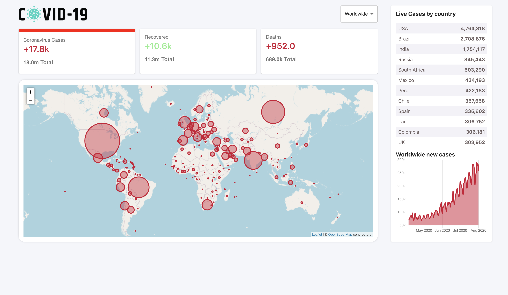
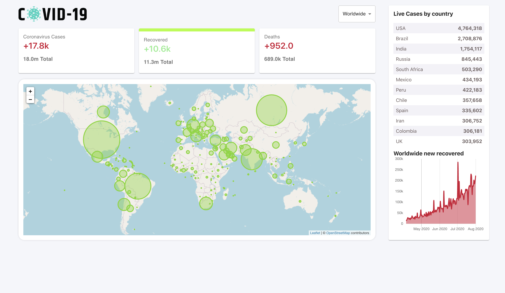
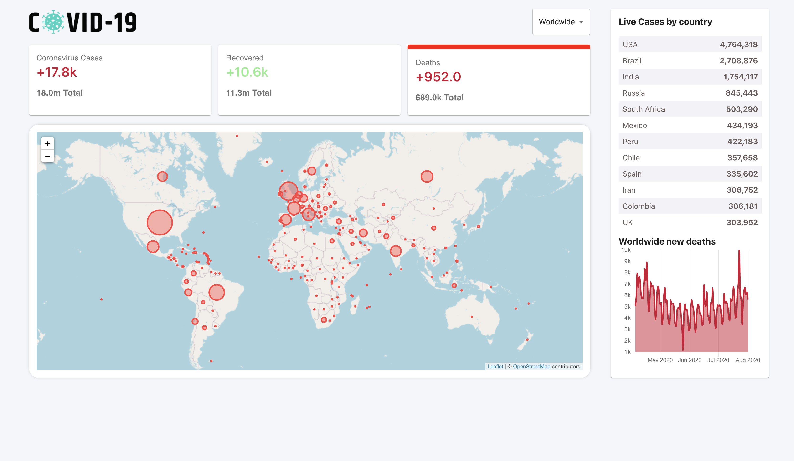
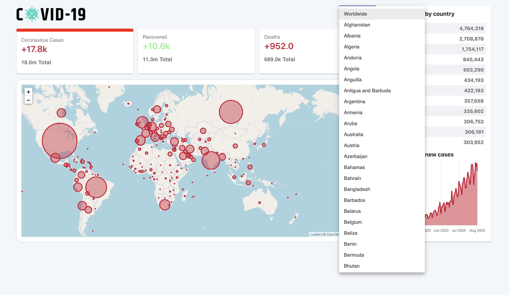
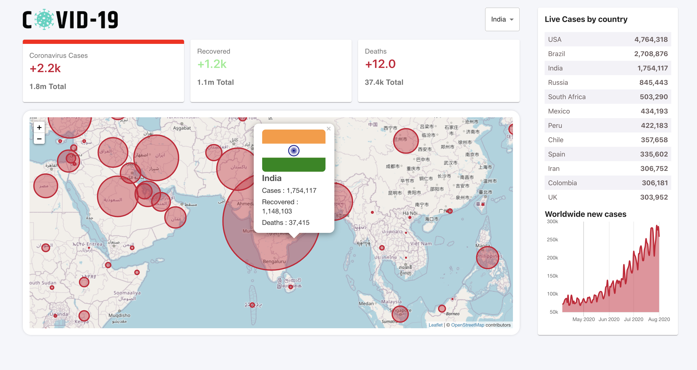

# COVID-19 TRACKER

A COVID 19 Tracker app created using React.js.
Deployed using firebase. Can be accessed using this [link](https://covid-tracker-1e566.web.app)

## Sample Screenshots

### Worldwide cases

### Worldwide recoveries

### Worldwide deaths

### Filter countries

### Country specific cases (INDIA)

## To run the app locally

### `npm install`

### `npm start`
